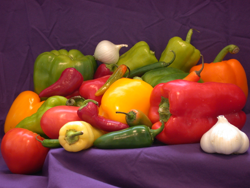

# Image-Processing-with-opencv

#### First of all, it is a visual studio 2015 project so if you want only the code go to ergasia1-->main.cpp

**Code summary:**
* mouse handler presenting the **RGB values** of the picture pixels and the **HSI** brightness
* converting to grayscale
* adding noise with **gaussian & Salt and Pepper** filtering
* denoising with **mean** and **median** filtering
* edge detection with **Sobel** and **Prewitt** algorithms
* image segmentation with **adaptive thresholding**

Initial Picture:

**RESULTS:**

